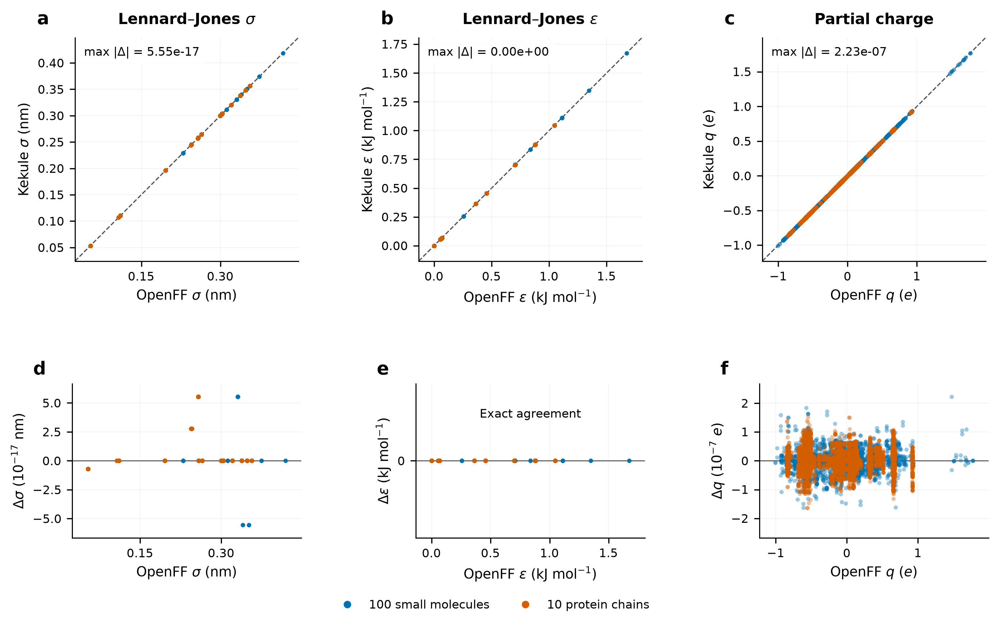
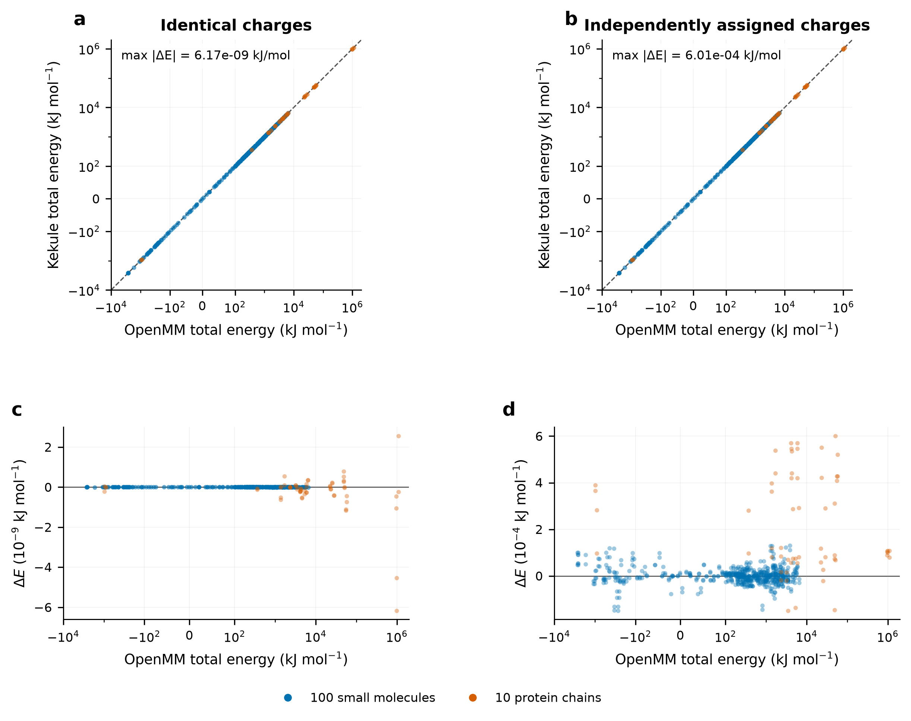
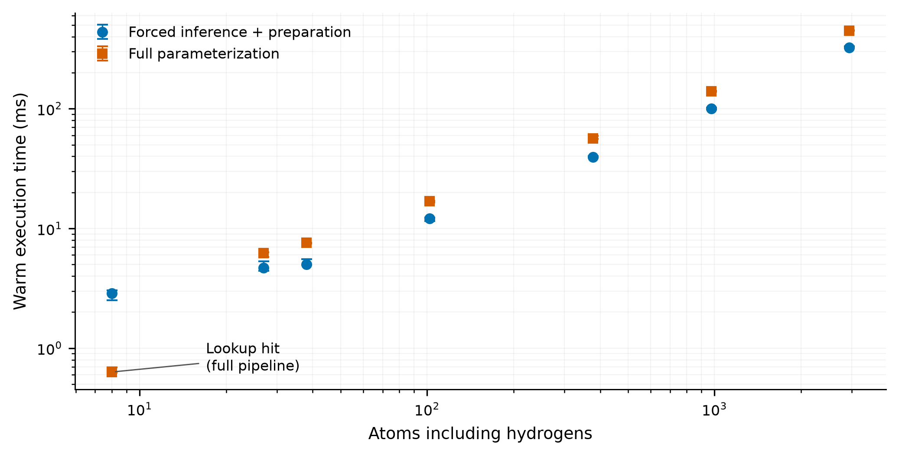

# kekule-openff: numerical validation

Experimental Rust implementation of the OpenFF parameterization engine.
The Rosemary parameterization port reproduces parameter assignments and charges
for **100 small molecules and 10 protein chains**, with energy agreement checked
at three geometries per molecule and in two atom orders.

| Validation measure | Result |
| --- | ---: |
| Parameterization cases passing all parameter, feature, charge and energy comparisons | **220 / 220** |
| Geometry comparisons | **660 / 660** |
| Paired atomic charges and vdW parameters | **29,252** |
| Maximum partial-charge difference | **2.229 × 10⁻⁷ e** |
| Maximum total-energy difference, identical charges | **6.170 × 10⁻⁹ kJ/mol** |
| Maximum total-energy difference, independently assigned charges | **6.011 × 10⁻⁴ kJ/mol** |
| Strict cases, including standalone InChI diagnostics | **214 / 220** |

## Parameter and charge parity

**Figure 1.** Kekule versus OpenFF Lennard–Jones parameters and final partial
charges. Dashed lines in panels a–c indicate exact agreement; panels d–f show
signed residuals, **Δ = Kekule − OpenFF**, at expanded scales. Every paired atom
from both atom orders is included. Repeated parameter values overlap; points are
not jittered or subsampled. Blue denotes small molecules and orange protein
chains. Exact epsilon agreement is shown on a zero-only residual axis.
[PDF](figures/parameter-parity.pdf) · [SVG](figures/parameter-parity.svg)

| Quantity | Unit | Paired values | Maximum absolute difference | RMSE |
| --- | --- | ---: | ---: | ---: |
| Partial charge | e | 29,252 | 2.229 × 10⁻⁷ | 2.691 × 10⁻⁸ |
| vdW sigma | nm | 29,252 | 5.551 × 10⁻¹⁷ | 1.261 × 10⁻¹⁷ |
| vdW epsilon | kJ/mol | 29,252 | 0 | 0 |
| Bond equilibrium length | nm | 29,712 | 0 | 0 |
| Bond force constant | kJ mol⁻¹ nm⁻² | 29,712 | 2.328 × 10⁻¹⁰ | 4.233 × 10⁻¹¹ |
| Angle equilibrium value | rad | 53,358 | 0 | 0 |
| Angle force constant | kJ mol⁻¹ rad⁻² | 53,358 | 0 | 0 |
| Proper-torsion coefficient | kJ/mol | 108,504 | 0 | 0 |
| Improper-torsion coefficient | kJ/mol | 18,624 | 0 | 0 |
| Constraint distance | nm | 14,408 | 0 | 0 |
| Atom feature value | feature-specific | 643,544 | 9.934 × 10⁻⁹ | 1.918 × 10⁻¹⁰ |

Torsion phases, periodicities, and division factors also agree exactly. Torsion
counts include all Fourier terms and improper multiplicities. Rule IDs, SMIRKS,
interaction coverage, and exception pairs are checked separately from numerical
values. The maximum deviation of summed atomic charge from formal molecular
charge is **5.596 × 10⁻¹⁴ e**.

Numerical parameters use absolute tolerance `1e-10` and relative tolerance
`1e-12`, through Python `math.isclose`; the relative term accommodates the tiny
rounding difference in the large bond force constants. Charges use absolute
tolerance **5e-5 e**, molecular charge sums `1e-6 e`, and features `1e-6`.
RMSE is computed over all paired values, so larger molecules contribute more
atoms. The two atom orders test invariance and are not independent molecules.

The separate **66-case suite** (33 molecules in two atom orders) also passes.
It exercises additional lookup/library-charge paths. Its maximum final charge
difference is **2.9996 × 10⁻⁵ e**, caused by assigning slightly asymmetric stored
lookup charges to symmetry-equivalent atoms. Its maximum forced-network
difference is **2.5332 × 10⁻⁷ e**. Those results are kept separate from the
110-molecule statistics above; the original values and mappings are preserved
in the [archived recheck](robustness-original-66-recheck.json.gz).

## Energy parity

**Figure 2.** Rust energy evaluation using `potentials` versus OpenMM, for all
660 geometry/atom-order comparisons. Left: both engines use the OpenFF charges,
isolating parameter assignment and energy evaluation. Right: Kekule uses its
own assigned charges, exposing their propagated electrostatic effect. The
energy axes use a symmetric logarithmic scale, linear between −100 and
+100 kJ/mol; the residual axes are linear and have different labeled scales.
All observations, including large energies from strained geometries, are shown.
[PDF](figures/energy-parity.pdf) · [SVG](figures/energy-parity.svg)

| Energy component | Maximum absolute difference (kJ/mol) | RMSE (kJ/mol) |
| --- | ---: | ---: |
| Bonds | 3.027 × 10⁻⁹ | 1.356 × 10⁻¹⁰ |
| Angles | 7.640 × 10⁻¹¹ | 6.068 × 10⁻¹² |
| Proper torsions | 4.184 × 10⁻¹¹ | 2.824 × 10⁻¹² |
| Improper torsions | 3.467 × 10⁻¹² | 1.993 × 10⁻¹³ |
| vdW | 3.024 × 10⁻¹⁰ | 2.355 × 10⁻¹¹ |
| Electrostatics, identical charges | 6.054 × 10⁻⁹ | 3.407 × 10⁻¹⁰ |
| Total, identical charges | 6.170 × 10⁻⁹ | 3.345 × 10⁻¹⁰ |
| Electrostatics, independently assigned charges | 6.011 × 10⁻⁴ | 9.790 × 10⁻⁵ |
| Total, independently assigned charges | 6.011 × 10⁻⁴ | 9.790 × 10⁻⁵ |

Each row contains 660 comparisons. The reference Hamiltonian is **vacuum,
nonperiodic NoCutoff**, with constrained bond terms retained in the energy.
Both engines use identical coordinates, Lorentz–Berthelot mixing, and matching
graph-based nonbonded exceptions. The three geometries are the prepared input
and seeded displacements of 0.002 and 0.01 nm standard deviation. These are
unminimized stress cases; large positive energies do not indicate stable conformers.

Identical-charge energies use absolute tolerance `1e-7 kJ/mol` and relative
tolerance `1e-10`. Independently assigned charges are evaluated separately
against a Coulomb error bound calculated from actual charge differences,
distances, and exception scales. This preserves the strict identical-charge
comparison while making the effect of charge roundoff explicit.

## CPU inference and parameterization time

**Figure 3.** Warm CPU execution times on an **Intel Core i5-11400F**, Windows
x86-64, Rust 1.94.1, release build, default CPU target and `ndarray` backend.
Points show medians; bars show the observed minimum and maximum, not confidence
intervals. No scaling fit is implied. The eight-atom molecule uses a charge
lookup in the full pipeline, making that path faster than forced inference.
[PDF](figures/cpu-timings.pdf) · [SVG](figures/cpu-timings.svg)

| Input | Atoms including H | Forced inference + preparation (ms) | Normal charge assignment (ms) | Full parameterization (ms) |
| --- | ---: | ---: | ---: | ---: |
| PubChem 11642 | 8 | 2.86 | 0.092 (lookup) | 0.63 |
| PubChem 111320 | 27 | 4.68 | 4.84 | 6.22 |
| PubChem 446684 | 38 | 5.02 | 5.34 | 7.59 |
| PubChem 476793 | 102 | 12.07 | 12.26 | 16.95 |
| PDB 6EE9, chain X | 378 | 39.47 | 41.94 | 56.32 |
| PDB 1W1F, chain A | 974 | 100.55 | 100.14 | 139.76 |
| PDB 3ABD, chain A | 2,940 | 324.52 | 320.83 | 447.83 |

These seven inputs are a size-spanning subset of the validation panel. Molecules
were parsed before timing; model and force field stayed loaded. Each operation
received one warm-up, then five charge/feature measurements or three full
parameterization measurements. Forced inference includes chemical preparation,
domain checks, feature construction, the network, and charge normalization.
Full parameterization includes normal charge selection and force-field
assignment, but no energy calculation. The columns are independent measurements,
not timings to be added together. Model loading took **29.6 ms** in one separately
recorded observation and is excluded from the table.

These measurements describe single-molecule latency on one machine. They do not
establish batch throughput, cross-platform performance, or GPU acceleration;
the current engine runs on CPU. The [timing archive](cpu-timings.json) preserves
every repetition, input SMILES, build information, executable fingerprint, and
the exact standalone Rust probe source and manifest.

## Dataset, reference versions, and coverage

Small molecules were selected deterministically from the Kekule `pubchem-100k`
benchmark, using chemical diversity descriptors without consulting Kekule
success. They contain 3–40 heavy atoms, or 8–102 atoms with hydrogens.
Protein chains were sourced from `pdb-1000`: ten independently preparable chains
from distinct entries, with 25–180 residues and 378–2,940 atoms including H.
Hydrogen preparation used OpenMM at pH 7; OpenFF supplied bond orders and formal
charges. Waters, other chains, and ligands were excluded. There were 66 recorded
read/preparation failures before selection completed; these remain archived and
are outside the 110 prepared-input denominator. Full source hashes, preparation
details, and the ten protein identities are in [ROBUSTNESS.md](ROBUSTNESS.md).

| Reference component | Pinned version |
| --- | --- |
| Rosemary OFFXML | `openff_no_water-3.0.0-alpha2b` |
| Ash model | `openff-gnn-am1bcc-1.0.0.pt`, checksum-pinned |
| OpenFF Toolkit / NAGL / Interchange | 0.19.0 / 0.6.1 / 0.5.5 |
| RDKit / PyTorch / NumPy | 2026.03.3 / 2.10.0 / 2.5.3 |
| OpenMM reference / Rust `potentials` consumer | 8.6.1 / 0.1.0 |

| SMIRNOFF handler | Rules exercised in the 110-molecule panel | Rules in Rosemary |
| --- | ---: | ---: |
| Bonds | 66 | 90 |
| Angles | 35 | 42 |
| Proper torsions | 116 | 187 |
| Improper torsions | 7 | 7 |
| vdW | 23 | 35 |
| Constraints | 1 | 1 |

The panel has 218 inference and two lookup observations. Coverage is substantial
but incomplete: additional rule coverage, all lookup mappings, periodic PME and
switching, analytic forces, constraint enforcement, solvated complexes, and MD
stability require separate validation. Protein graph compatibility does not
establish Rosemary's empirical suitability for protein simulations. Scientific
parity here was measured on Windows; Linux/macOS numerical parity remains to be
established. Ash inference currently has a 4,096-atom resource limit.

For small eligible molecules, a remaining compatibility difference is that
native InChI generation errors propagate, whereas upstream treats an empty
InChI as a lookup miss and attempts inference. The supported runtime boundaries
are documented in the [crate contract](../../crates/kekule-openff/CONTRACT.md).
